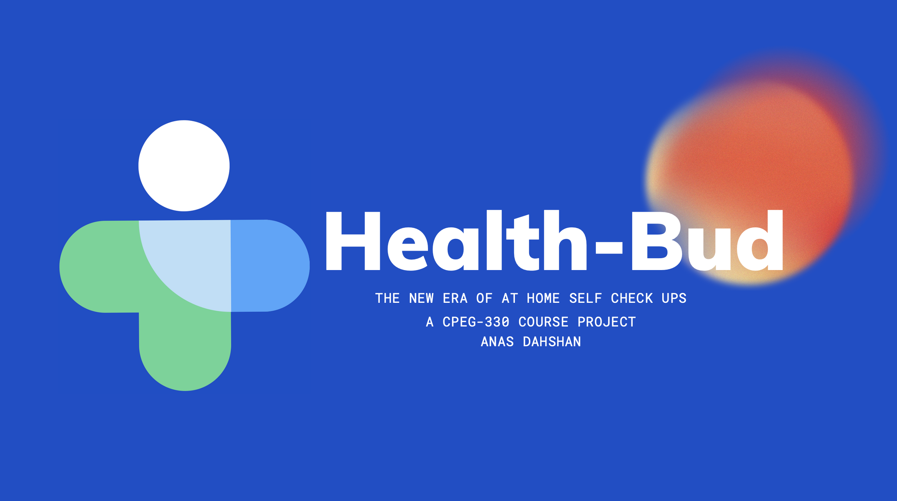
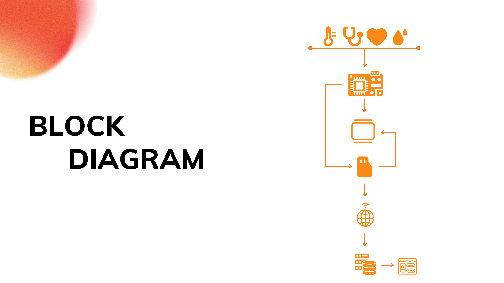
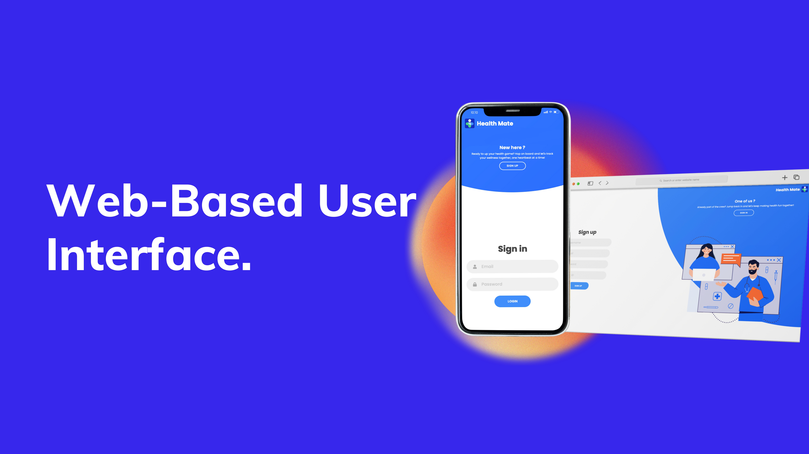

# Health-Bud

**A Smart Health Multimeter**



Health-Bud is a portable, smart health monitoring device that integrates multiple sensors to measure vital health parameters project created for my Embeded Systems course. It features a contactless temperature sensor, a pulse oximeter, and a digital stethoscope, providing users with real-time health insights. Data is recorded locally and uploaded to the cloud, allowing remote access and analysis via a web-based interface.

https://github.com/user-attachments/assets/eae2cb09-8c7e-4c13-b0cf-144175085844

## Block Diagram



## Features

- **Contactless Temperature Sensor** *(GY-906 MLX90614ESF)*  Measures body temperature without physical contact.

- **Pulse Oximeter** *(MAX30102)*  Monitors heart rate and blood oxygen levels (SpO2).

- **Digital Stethoscope** *(Electret Microphone Amplifier - MAX4466 with Adjustable Gain & Littmann Stethoscope)*  Records heartbeat sounds for medical analysis.

- **Dual OLED Displays** *(128x64 & 128x32 via I2C Multiplexer)*  Provides a clear and dynamic user interface.

- **Data Storage & Cloud Sync**  Logs health data to an SD card and synchronizes with Firebase Firestore.

- **Web-Based UI**  Enables remote viewing of health data, appointment scheduling, and audio streaming for medical consultations.

- **Audio Recording for Heartbeat Analysis**  Users can record and stream their heartbeat sounds for remote diagnosis.

## System Components

| Component              | Description                                        |
| ---------------------- | -------------------------------------------------- |
| **Microcontroller**    | Arduino Uno R4                                     |
| **Temperature Sensor** | GY-906 MLX90614ESF (IR)                            |
| **Pulse Oximeter**     | MAX30102 PPG Sensor                                |
| **Stethoscope**        | MAX4466 Electret Microphone & Littmann Stethoscope |
| **Display Modules**    | 1.3" 128x64 OLED & 0.91" 128x32 OLED               |
| **Multiplexer**        | TCA9548A I2C Multiplexer                           |
| **Storage**            | Micro SD Card Reader Module                        |
| **Connectivity**       | Firebase Firestore & Web UI                        |
| **Audio Output**       | 3.5mm Audio Jack for Heartbeat Recording           |

## How It Works

1. **Startup & Menu Navigation**: The system displays an interactive menu on the OLED screens.
2. **Vital Sign Measurement**: Users can measure body temperature, heart rate, and oxygen levels.
3. **Heartbeat Recording**: The digital stethoscope records and streams heartbeat sounds.
4. **Data Logging & Syncing**: Readings are stored on an SD card and uploaded to Firestore for remote access.
5. **Web Interface**: Users can view their health data, book medical appointments, and share records with doctors.


## Installation & Usage

### **Hardware Setup**

1. Assemble the **Arduino Uno R4** with all sensors and modules.
2. Ensure the **OLED displays** are connected via the **I2C multiplexer**.
3. Attach the **stethoscope microphone** to capture heartbeat audio.
4. Insert a **formatted micro SD card** into the reader for data logging.

## Hardware Prototype


### **Software Setup**

1. **Clone the repository**:

   ```bash
   git clone https://github.com/your-username/Health-Bud.git
   cd Health-Bud
   ```

2. **Install Arduino Libraries**:

   - Adafruit GFX Library
   - Adafruit SSD1306 OLED Display Library
   - Wire.h (for I2C communication)
   - Firebase Arduino Library
   - MAX30102 Pulse Oximeter Library

3. **Upload Code to Arduino**:

   - Open the `.ino` file in the **Arduino IDE**.
   - Select **Arduino Uno R4** as the board.
   - Upload the code.

4. **Web Interface Setup**:

   - Host the **HTML, CSS, and JavaScript files** for the dashboard.
   - Connect Firebase Firestore for real-time data retrieval.

## Web Interface Features



- **User Registration & Login**
- **Live Health Data Monitoring**
- **Heartbeat Sound Streaming**
- **Appointment Booking**
- **Doctor Access for Remote Diagnosis**

## Future Improvements

- AI-driven health analysis based on collected data.
- Improved signal processing for the stethoscope audio.
- Mobile app integration for easier accessibility.

## License

This project is open-source and licensed under the **MIT License**.

## Contributors

- **Anas Abdallah Dahshan** *(Project Creator & Developer)*

## Acknowledgments

Special thanks to **Professor Mounib Khanafer** for his guidance and inspiration in embedded systems and IoT development.
